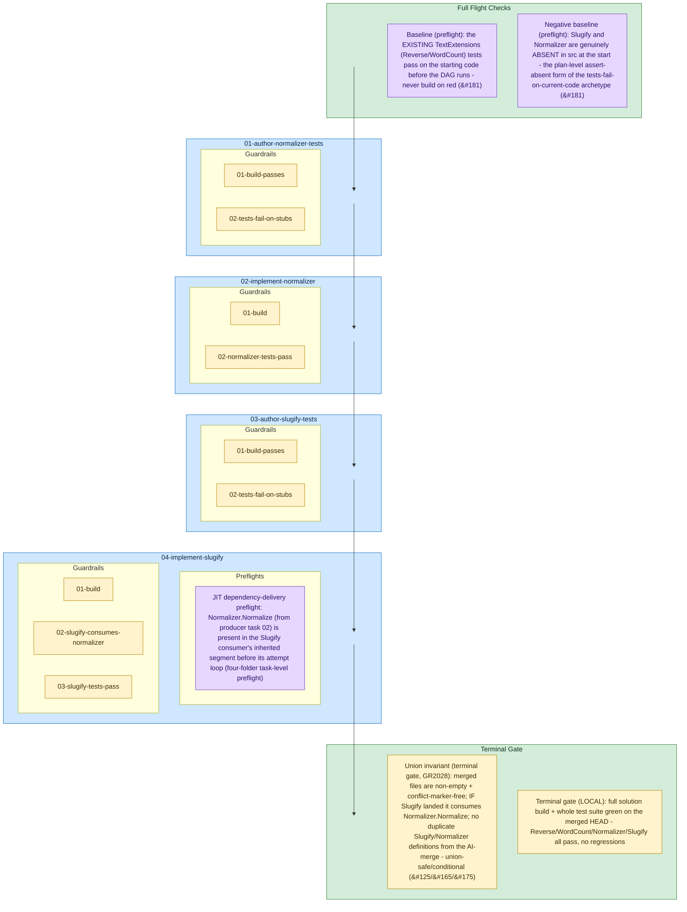

<!-- guardrails:graph v1 source-sha256=78c8a3e17e443e385d7baece30aed2a0109ce695c3695482f1dba7957257c756 -->

```mermaid
flowchart TD
  subgraph plan_preflights["Full Flight Checks"]
    plan_preflights_anchor[" "]:::invisible
    plan_preflights_0["Baseline (preflight): the EXISTING TextExtensions (Reverse/WordCount) tests pass on the starting code before the DAG runs - never build on red (&#35;181)"]:::preflight
    plan_preflights_1["Negative baseline (preflight): Slugify and Normalizer are genuinely ABSENT in src at the start - the plan-level assert-absent form of the tests-fail-on-current-code archetype (&#35;181)"]:::preflight
  end
  class plan_preflights planLevel;
  subgraph task_01_author_normalizer_tests["01-author-normalizer-tests"]
    task_01_author_normalizer_tests_anchor[" "]:::invisible
    subgraph task_01_author_normalizer_tests_guardrails["Guardrails"]
      task_01_author_normalizer_tests_gr_0["01-build-passes"]:::guardrail
      task_01_author_normalizer_tests_gr_1["02-tests-fail-on-stubs"]:::guardrail
    end
  end
  class task_01_author_normalizer_tests task;
  subgraph task_02_implement_normalizer["02-implement-normalizer"]
    task_02_implement_normalizer_anchor[" "]:::invisible
    subgraph task_02_implement_normalizer_guardrails["Guardrails"]
      task_02_implement_normalizer_gr_0["01-build"]:::guardrail
      task_02_implement_normalizer_gr_1["02-normalizer-tests-pass"]:::guardrail
    end
  end
  class task_02_implement_normalizer task;
  subgraph task_03_author_slugify_tests["03-author-slugify-tests"]
    task_03_author_slugify_tests_anchor[" "]:::invisible
    subgraph task_03_author_slugify_tests_guardrails["Guardrails"]
      task_03_author_slugify_tests_gr_0["01-build-passes"]:::guardrail
      task_03_author_slugify_tests_gr_1["02-tests-fail-on-stubs"]:::guardrail
    end
  end
  class task_03_author_slugify_tests task;
  subgraph task_04_implement_slugify["04-implement-slugify"]
    task_04_implement_slugify_anchor[" "]:::invisible
    subgraph task_04_implement_slugify_preflights["Preflights"]
      task_04_implement_slugify_pf_0["JIT dependency-delivery preflight: Normalizer.Normalize (from producer task 02) is present in the Slugify consumer's inherited segment before its attempt loop (four-folder task-level preflight)"]:::preflight
    end
    subgraph task_04_implement_slugify_guardrails["Guardrails"]
      task_04_implement_slugify_gr_0["01-build"]:::guardrail
      task_04_implement_slugify_gr_1["02-slugify-consumes-normalizer"]:::guardrail
      task_04_implement_slugify_gr_2["03-slugify-tests-pass"]:::guardrail
    end
  end
  class task_04_implement_slugify task;
  subgraph plan_guardrails["Terminal Gate"]
    plan_guardrails_anchor[" "]:::invisible
    plan_guardrails_0["Union invariant (terminal gate, GR2028): merged files are non-empty + conflict-marker-free; IF Slugify landed it consumes Normalizer.Normalize; no duplicate Slugify/Normalizer definitions from the AI-merge - union-safe/conditional (&#35;125/&#35;165/&#35;175)"]:::guardrail
    plan_guardrails_1["Terminal gate (LOCAL): full solution build + whole test suite green on the merged HEAD - Reverse/WordCount/Normalizer/Slugify all pass, no regressions"]:::guardrail
  end
  class plan_guardrails planLevel;
  plan_preflights_anchor --> task_01_author_normalizer_tests_anchor
  task_01_author_normalizer_tests_anchor --> task_02_implement_normalizer_anchor
  task_02_implement_normalizer_anchor --> task_03_author_slugify_tests_anchor
  task_03_author_slugify_tests_anchor --> task_04_implement_slugify_anchor
  task_04_implement_slugify_anchor --> plan_guardrails_anchor
  classDef task fill:#cfe8ff,stroke:#1b6ec2,color:#0b2545;
  classDef preflight fill:#e6d7ff,stroke:#6f42c1,color:#2e1065;
  classDef guardrail fill:#fff3cd,stroke:#b8860b,color:#3d2c00;
  classDef planLevel fill:#d4edda,stroke:#2e7d32,color:#10341a;
  classDef invisible fill:none,stroke:none;
```

_Structure only — retry, feedback, and needs-human edges are omitted._
